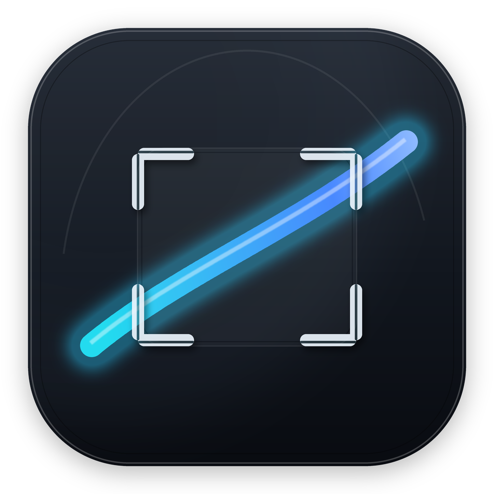
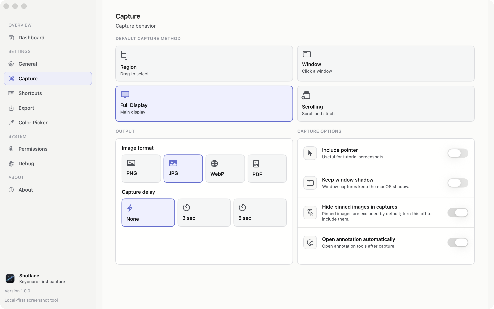
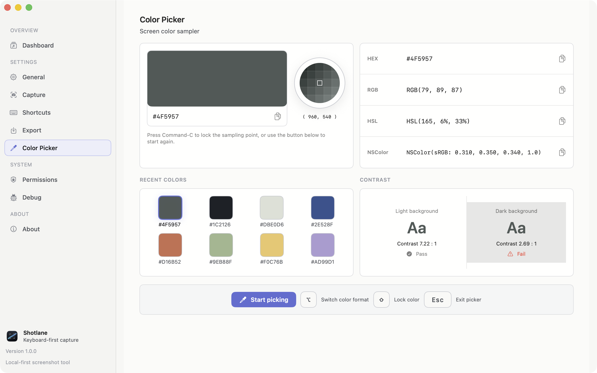
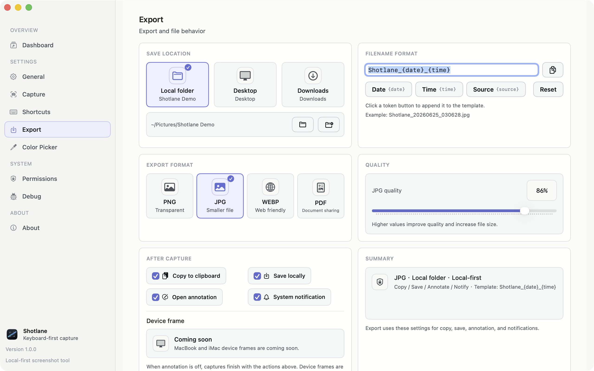
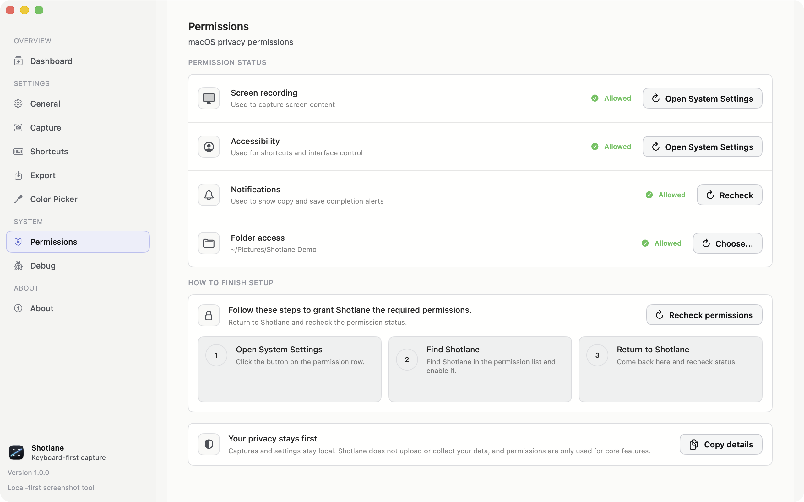
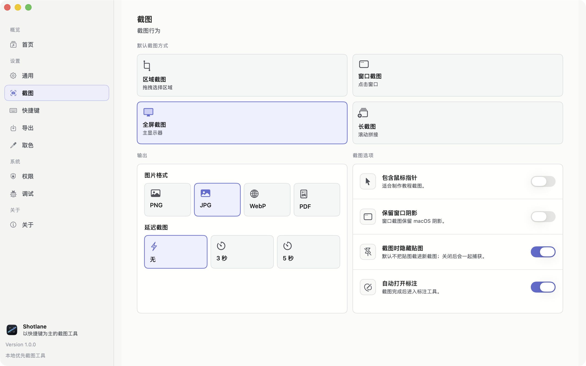
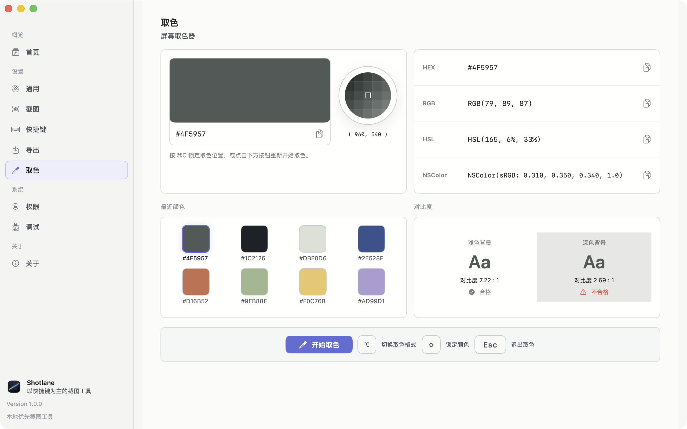
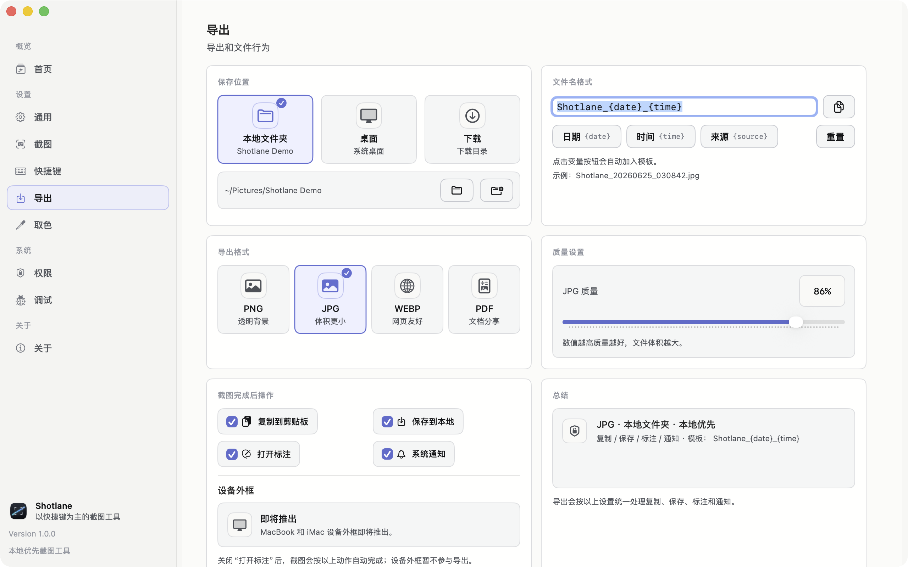
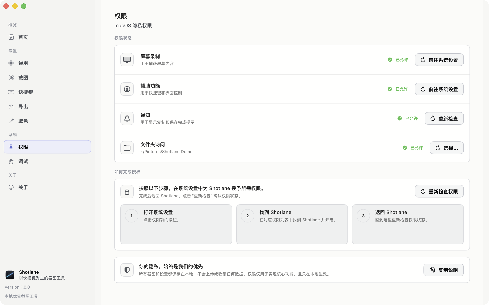

  

<h1 align="center">Shotlane</h1>

  A local-first screenshot workflow for macOS. 
  所见即截，所截即用。

  <a href="https://shotlane.vercel.app/">Website</a> ·
  <a href="https://shotlane.vercel.app/support/">Support</a> ·
  <a href="https://shotlane.vercel.app/privacy/">Privacy</a> ·
  <a href="https://github.com/blainehuang1028/shotlane-showcase/issues">Feedback</a>

> [!IMPORTANT]
> This is Shotlane's public product and engineering showcase. It does not contain the production application source code, build system, signing configuration, bundled models, or release credentials. No license to Shotlane source code, binaries, branding, or media is granted by this repository.

## English

Shotlane brings capture, annotation, OCR, color picking, pinned references, and clean export into one native Mac workflow. Screenshot content and recognized text stay on the user's Mac.

### Product highlights

- Region, window, full-display, and stitched scrolling capture.
- Editable annotations for shapes, arrows, brush strokes, mosaic, text, markers, and highlights.
- Local OCR using Apple Vision or a bundled on-device recognition engine.
- A screen color picker with HEX, RGB, HSL, NSColor, recent picks, and contrast checks.
- Floating pinned references that can stay above other apps without appearing in later captures.
- PNG, JPG, WebP, and PDF export with local folders, filename rules, and cleanup controls.
- Global shortcuts, permission guidance, diagnostics, and five interface languages.

### Product UI

| Capture and workflow | Color and local privacy |
| --- | --- |
|  |  |
|  |  |

### Engineering notes

- [Architecture overview](docs/architecture.md)
- [Privacy model](docs/privacy.md)
- [Development notes](docs/development-notes.md)
- [Support and feedback](SUPPORT.md)

## 中文

Shotlane 把截图、标注、OCR、取色、贴图参考和干净导出整合成一个原生 Mac 工作流。截图内容与识别文字都留在用户自己的 Mac 上。

### 产品能力

- 区域、窗口、整屏与拼接滚动长图。
- 形状、箭头、画笔、马赛克、文字、编号和高亮均可选择与重复编辑。
- 使用 Apple Vision 或随应用提供的本地识别引擎完成 OCR。
- 屏幕取色器提供 HEX、RGB、HSL、NSColor、最近取色与对比度检查。
- 贴图可浮在其他 App 上方，并默认从后续截图中排除。
- PNG、JPG、WebP、PDF 导出，支持本地目录、文件名规则与定时清理。
- 全局快捷键、权限引导、诊断信息和 5 种界面语言。

### 中文界面

| 截图与导出 | 取色与隐私 |
| --- | --- |
|  |  |
|  |  |

如需报告问题或提出建议，请使用 [GitHub Issues](https://github.com/blainehuang1028/shotlane-showcase/issues/new/choose)。普通使用问题也可以查看 [Support](https://shotlane.vercel.app/support/)。

## Repository scope

This repository is maintained for product presentation, public engineering notes, and user feedback only. It is not a source distribution and is not intended to be buildable.

Copyright © 2026 Blaine. All rights reserved.
